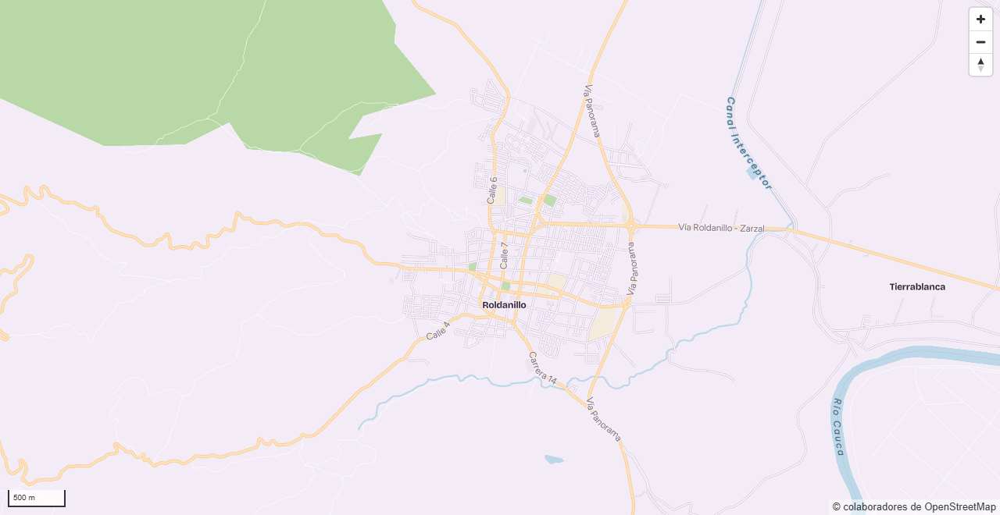
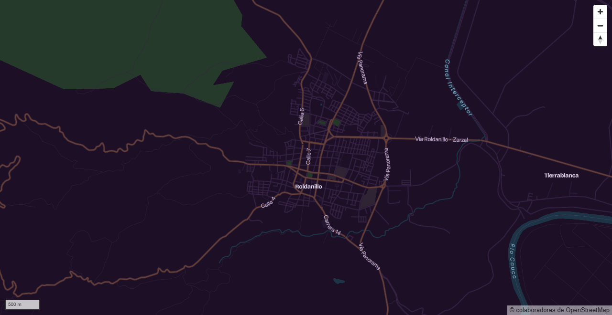
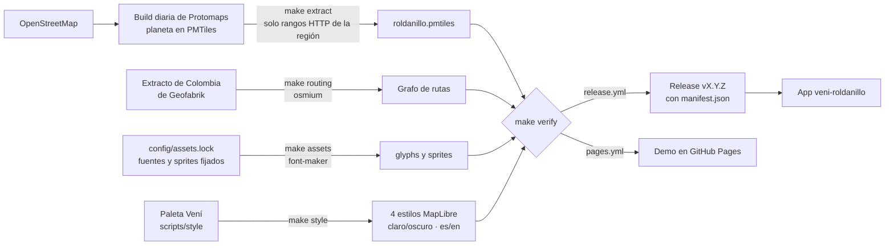

# Vení · Mapa de Roldanillo

[](https://github.com/WokerJJ/veni-mapa/actions/workflows/ci.yml)
[](https://github.com/WokerJJ/veni-mapa/releases/latest)
[](https://wokerjj.github.io/veni-mapa/)
[](https://opendatacommons.org/licenses/odbl/1-0/)

Pipeline reproducible que recorta Roldanillo (Valle del Cauca, Colombia) de OpenStreetMap, lo empaqueta como [PMTiles](https://docs.protomaps.com/pmtiles/) y genera un estilo [MapLibre](https://maplibre.org/) con la marca **Vení**. Cada versión se publica como release para que la app [veni-roldanillo](https://github.com/WokerJJ/veni-roldanillo) la consuma sin depender de la API de Google Maps.

| Claro | Oscuro |
| --- | --- |
|  |  |

Las capturas las genera la prueba de render (ver [Pruebas](#pruebas)). El avance y las decisiones están en [docs/BITACORA.md](docs/BITACORA.md).

## Cómo funciona



1. **Datos:** Protomaps publica cada día el planeta de OpenStreetMap como un solo PMTiles. `make extract` recorta la caja de Roldanillo pidiendo por rangos HTTP solo esa zona, sin descargar el planeta.
2. **Recursos:** las fuentes de la marca y los sprites se descargan fijados por commit y SHA-256, y font-maker los convierte en glyphs que MapLibre puede servir sin CDN.
3. **Estilos:** `@protomaps/basemaps` genera las capas y la paleta de Vení las colorea; salen cuatro variantes con URLs absolutas a donde se publiquen los datos.
4. **Verificación y publicación:** todo pasa por `make verify` (validador de MapLibre y chequeos del extracto). Cada release adjunta las piezas con sus sumas SHA-256, y la app las consume.

## Requisitos

- **Docker** (Docker Desktop en Windows o macOS). Es lo único necesario para generar el mapa. `make routing` descarga una vez ~330 MB de OpenStreetMap, que quedan en caché en `build/`.
- **Node 24** en el host, solo para la prueba de render con Playwright, que no corre en Alpine.

## Uso

Para generar el mapa solo hace falta Docker. Todas las herramientas (make, pmtiles, font-maker, yq, jq y Node 24) vienen en la imagen de [`docker/tools`](docker/tools/Dockerfile), la misma que usa la CI:

```bash
docker compose run --rm tools make help      # lista los objetivos
docker compose run --rm tools make extract   # build/roldanillo.pmtiles
```

| Objetivo | Qué hace |
| --- | --- |
| `extract` | Resuelve la build diaria más reciente de Protomaps, corre `pmtiles extract --dry-run` (reporte en `build/extract-report.txt`) y extrae la región a `build/<región>.pmtiles`. Deja la procedencia (build, bbox, tamaño, SHA-256) en `build/build.json`. |
| `routing` | Descarga (en caché) el extracto de OSM de Geofabrik, recorta las vías de la región con osmium y arma el grafo de rutas en `build/routing/<región>-rutas.json` (ver [Rutas](#rutas)). |
| `assets` | Descarga las fuentes y los sprites de [`config/assets.lock`](config/assets.lock) (fijados por commit y verificados por SHA-256) y genera en `build/assets` los glyphs de [`config/fontstacks.yml`](config/fontstacks.yml) con [font-maker](https://github.com/maplibre/font-maker). |
| `style` | Genera `build/style/veni-{claro,oscuro}-{es,en}.json` con la marca Vení. `STYLE_BASE_URL` fija dónde se publican PMTiles, glyphs y sprites (por defecto `http://localhost:8080`). |
| `check` | Verificación de tipos (TypeScript), pruebas de Node (estilos, `build.ts`, servidor) y que `licenses/vendor-deps.txt` esté al día. |
| `verify` | Valida los estilos con el validador oficial de MapLibre y el extracto: tiles vectoriales, caja dentro de la región, zoom máximo = mín(pedido, build), capas esperadas y tamaño (`PMTILES_MAX_MB`, 50 por defecto). |
| `licenses` | Regenera `licenses/vendor-deps.txt` con los avisos de lo que MapLibre GL y PMTiles empaquetan (`make check` falla si quedó desactualizado). |
| `site` | Arma `build/site`, el árbol que se publica: demo, PMTiles, recursos, estilos y licencias. |
| `serve` | Sirve `build/site` en <http://localhost:8080> con rangos HTTP. Necesita el puerto: `docker compose run --rm --service-ports tools make serve`. |
| `release` | Arma `dist/` con lo que se adjunta a una release (ver [Releases](#releases)). Exige `RELEASE_VERSION=X.Y.Z` y estilos generados con `STYLE_VERSION` igual. |
| `all` | `extract`, `routing`, `assets`, `style` y `site`. |

Para reproducir una versión exacta, fijá la build (funciona igual en bash y en PowerShell):

```bash
docker compose run --rm tools make extract BUILD_DATE=20260928
```

La misma build produce siempre el mismo archivo (mismo SHA-256 en `build/build.json`).

En Linux, el contenedor corre con tu usuario para que `build/` no quede de root: exportá `HOST_UID=$(id -u)` y `HOST_GID=$(id -g)` si tu uid no es 1000.

Si tu `build/` lo creó una versión anterior de la imagen (que corría como root) y ves `Permission denied`, borralo una vez con `docker compose run --rm --user 0:0 tools rm -rf build`.

La extracción no descarga el planeta: `pmtiles` pide por rangos HTTP solo los tiles de la región (unos 1,6 MB hoy).

## Demo

<https://wokerjj.github.io/veni-mapa/> · la publica [`pages.yml`](.github/workflows/pages.yml) en cada cambio en `main`.

MapLibre GL y PMTiles autohospedados (sin CDN), botones para tema claro u oscuro y etiquetas en español o inglés, con la interfaz traducida. Lo que elegís queda en la URL (`?tema=oscuro&idioma=en`) y la vista en el fragmento (`#vista=zoom/lat/lon`); sin tema elegido, la demo sigue la preferencia del sistema, también si cambia. Los controles de MapLibre también se traducen.

La cámara no sale de la región: el extracto guarda tiles enteros y en zooms bajos un tile cubre medio continente (en el zoom 0, el planeta), así que el estilo publica la caja de `config/region.yml` en `metadata["veni:bounds"]` y la demo la usa como `maxBounds`. La app hace lo mismo. Detalles de publicación y rangos HTTP en [docs/PUBLICACION.md](docs/PUBLICACION.md).

## Usar el mapa en la app

La app [veni-roldanillo](https://github.com/WokerJJ/veni-roldanillo) no copia este repositorio: carga un estilo publicado desde la variable de entorno `VITE_MAP_STYLE_URL`.

| Entorno | `VITE_MAP_STYLE_URL` |
| --- | --- |
| Local, con `make serve` | `http://localhost:8080/style/veni-claro-es.json` |
| Demo (sigue `main`, no es versionada) | `https://wokerjj.github.io/veni-mapa/style/veni-claro-es.json` |
| Producción, cuando R2 esté activo | `https://tiles.veniroldanillo.co/vX.Y.Z/veni-claro-es.json` (versión fija) |

El tema y el idioma los controla la app, no el mapa: cambia `claro`/`oscuro` y `es`/`en` en el nombre del archivo y llama a `map.setStyle(url, { diff: false })`. El mapa no trae botones propios.

```ts
import * as maplibregl from "maplibre-gl";
import "maplibre-gl/dist/maplibre-gl.css"; // controles, incluida la atribución
import { Protocol } from "pmtiles";

// Los estilos piden los tiles como pmtiles://…: MapLibre los lee por rangos HTTP.
const protocol = new Protocol();
maplibregl.addProtocol("pmtiles", protocol.tile);

const style = (await (await fetch(import.meta.env.VITE_MAP_STYLE_URL)).json()) as maplibregl.StyleSpecification;
// Metadatos de Vení en el estilo: la caja de la región (config/region.yml).
const metadata = style.metadata as { "veni:bounds": maplibregl.LngLatBoundsLike };

const map = new maplibregl.Map({
  container: "mapa",
  style,
  // Cámara explícita: sin ella el mapa arranca en 0,0 con zoom 0, salta a
  // Roldanillo al cargar el estilo y puede quedar vacío hasta moverlo.
  center: style.center as maplibregl.LngLatLike,
  zoom: style.zoom,
  // La cámara no sale de la región del extracto.
  maxBounds: metadata["veni:bounds"],
});
```

- **Atribución:** la fuente del estilo ya trae la atribución a OpenStreetMap en su idioma ("© colaboradores de OpenStreetMap" o "© OpenStreetMap contributors"); no ocultes el control de atribución de MapLibre (en móvil, `compact: true`).
- **Versiones:** en producción conviene fijar una versión (`/vX.Y.Z/`) y actualizarla a propósito. `manifest.json` de cada release dice qué build de OpenStreetMap trae y el SHA-256 de cada archivo. Ver [Releases](#releases).
- **Capas propias** (restaurantes, ubicación, rutas) las agrega la app encima con `map.addSource` y `map.addLayer`; este repositorio solo publica el mapa base.

## Rutas

`make routing` genera `roldanillo-rutas.json`, la red de calles de la región, para que la app calcule en el teléfono la ruta hasta un restaurante, sin servidor de rutas ni APIs de pago. Se publica junto al mapa (Pages y cada release) y [`scripts/routing/router.ts`](scripts/routing/router.ts) es la implementación de referencia que usa la app.

**De dónde sale.** El PMTiles no sirve para rutas: su geometría está simplificada, las calles no comparten nodos en los cruces y no trae `oneway`. Por eso se parte del extracto de Colombia de [Geofabrik](https://download.geofabrik.de/south-america/colombia.html), el archivo fechado más reciente (`ROUTING_DATE=AAAAMMDD` fija otro) y verificado con su MD5:

1. [`scripts/routing-source.sh`](scripts/routing-source.sh): osmium recorta la caja de `config/region.yml` (las calles que cruzan el borde quedan enteras), se queda con las vías (`highway=*`) y las escribe en OPL, con las coordenadas de sus nodos. La descarga (~330 MB) queda en caché en `build/cache/osm`.
2. [`scripts/routing/build.ts`](scripts/routing/build.ts) arma el grafo: vértices solo en cruces y extremos de vía, y los nodos intermedios como geometría para dibujar.

**Perfiles** ([`scripts/routing/graph.ts`](scripts/routing/graph.ts)):

| | A pie | En vehículo |
| --- | --- | --- |
| Vías | Todas menos autopistas y `motorroad=yes` | De `motorway` a `track` (caminos de las veredas), sin peatonales ni senderos |
| Sentido único | No aplica (salvo `oneway:foot`) | `oneway=yes/-1`, glorietas y autopistas |
| Acceso | `foot`, si no `access` | `motorcar`, `motor_vehicle`, `vehicle`, si no `access` |
| Costo | Largo a 4,5 km/h | Largo a la velocidad de cada tipo de vía (de 90 km/h en autopista a 10 km/h en `living_street`) |

`private`, `no`, `agricultural` y `forestry` cierran el paso; `destination`, `customers` y `delivery` lo permiten.

**Formato `veni-rutas` v1.** JSON de enteros con codificación delta (grados × 10⁶): `nodes` (vértices), `edges` (desde, hasta, largo en decímetros, banderas de perfil y sentido, tipo de vía), `geometry` y `geometry_counts` (puntos intermedios de cada arista). Pesa ~567 KB, ~215 KB con gzip (Pages y Cloudflare lo comprimen solos); `make verify` exige que no pase de `ROUTING_MAX_KB` (500), que la caja y el origen coincidan con `source.json`, que al menos el 90 % de la red esté conectada (la mayor componente fuertemente conexa de cada perfil) y corre las rutas conocidas de [`tests/data/rutas-roldanillo.test.ts`](tests/data/rutas-roldanillo.test.ts). Se eligió JSON sobre formatos como los de OSRM o GraphHopper porque esos asumen un servidor, y sobre un binario propio porque el navegador lo decodifica de forma nativa y se puede inspeccionar a mano.

**En la app** (`VITE_MAP_ROUTES_URL` apunta a `roldanillo-rutas.json` de la misma publicación que los estilos). La app copia `scripts/routing/router.ts` y `graph.ts` del tag de la versión que usa (el formato lleva versión y el router rechaza otra). `router.ts` importa `./graph.ts` con extensión, así que el `tsconfig` de la app necesita `"moduleResolution": "bundler"` y `"allowImportingTsExtensions": true` (Vite lo resuelve solo). El router carga el grafo en ~40 ms y calcula una ruta en unos pocos ms (A*, la más rápida del grafo):

```ts
import type { GeoJSONSource, Map } from "maplibre-gl";
// scripts/routing/router.ts y graph.ts del tag vX.Y.Z de veni-mapa, copiados en la app.
import { Router, type LngLat, type Route } from "@veni/rutas";

declare const map: Map; // el mapa de "Usar el mapa en la app"

// El grafo (~215 KB con gzip) se descarga la primera vez que se pide una ruta,
// no al abrir el mapa. Si la descarga falla (sin señal, portal cautivo), se
// olvida la promesa para reintentar en la próxima ruta.
let router: Promise<Router> | undefined;
function loadRouter(): Promise<Router> {
  router ??= fetch(import.meta.env.VITE_MAP_ROUTES_URL)
    .then(async (res) => {
      if (!res.ok) throw new Error(`rutas: HTTP ${res.status}`);
      return new Router(await res.json());
    })
    .catch((error: unknown) => {
      router = undefined;
      throw error;
    });
  return router;
}

/** Dibuja la ruta y la devuelve (distance en m, duration en s), o null si no hay. */
export async function showRoute(from: LngLat, to: LngLat, profile: "foot" | "car"): Promise<Route | null> {
  const route = (await loadRouter()).route(from, to, profile);
  // Sin ruta (a más de 1 km de una vía): ofrecer abrir Google Maps o Waze.
  if (!route) return null;
  // route.snap dice cuántos metros hay de cada punto a la red: se dibujan aparte.
  const data: GeoJSON.Feature = { type: "Feature", properties: {}, geometry: { type: "LineString", coordinates: route.coordinates } };
  const source = map.getSource<GeoJSONSource>("ruta");
  if (source) source.setData(data);
  else {
    map.addSource("ruta", { type: "geojson", data });
    map.addLayer({ id: "ruta", type: "line", source: "ruta", paint: { "line-color": "#F0525A", "line-width": 5 } });
  }
  return route;
}
```

`route.coordinates` es la línea para dibujar, `route.distance` y `route.duration` sirven para mostrar "1,9 km · 25 min" y `route.snap` dice cuántos metros hay entre cada punto pedido y la red. La ubicación del usuario la da el dispositivo (control de geolocalización de MapLibre) y nunca sale del teléfono.

**Límites.** No es navegación paso a paso: los puntos se ajustan al cruce más cercano de la red principal (a menos de 1 km; así un punto junto a una calle aislada igual tiene ruta), no hay giros prohibidos, semáforos ni tráfico, y la duración es una estimación. Para navegar, la app ofrece abrir Google Maps o Waze por enlace. Geofabrik guarda los archivos fechados solo unos días (y el del 1 de enero de cada año), así que cada release nueva usa el más reciente y deja su procedencia en `manifest.json` (`routing.osm_date`, `source` y `source_md5`); al volver a adjuntar una release se reutiliza el grafo publicado, verificado con su SHA-256 ([`scripts/routing-published.sh`](scripts/routing-published.sh)), y nunca se rearma. En CI, Pages y la actualización mensual, `ROUTING_PREFER_CACHE=1` reusa el archivo en caché mientras Geofabrik lo siga listando (y si Geofabrik no responde).

## Estilos

Cuatro estilos MapLibre generados con [`@protomaps/basemaps`](https://github.com/protomaps/basemaps) y la paleta de la marca ([`scripts/style/flavors.ts`](scripts/style/flavors.ts)):

| | Claro | Oscuro |
| --- | --- | --- |
| Tierra | lila `#F3ECF6` | ciruela profunda `#1C0F26` |
| Vías principales | tinte de mango | mango mezclado con ciruela |
| Autopistas | tinte de arrebol | arrebol mezclado con ciruela |
| Etiquetas | ciruela `#2A1638` | lila |
| Lugares (municipio, barrios, departamentos, países) | Bricolage Grotesque Bold | Bricolage Grotesque Bold |

- Los tintes se calculan desde los tokens de la marca (`mix()`), así un cambio de marca se propaga.
- Etiquetas en español (`name:es`) o inglés (`name:en`), con el nombre local como respaldo.
- Toda capa con texto llega a 4.5:1 de contraste contra su halo, medido sobre el estilo generado; arrebol nunca es color de texto sobre fondo claro. Lo verifican las pruebas (`make check`).

### Dónde se publican

El estilo escribe URLs absolutas a partir de `STYLE_BASE_URL` y espera este árbol bajo esa base:

```text
<STYLE_BASE_URL>/
├── <región>.pmtiles          build/roldanillo.pmtiles
├── fonts/<fontstack>/…pbf    build/assets/fonts/
└── sprites/{light,dark}…     build/assets/sprites/
```

```bash
docker compose run --rm tools make style STYLE_BASE_URL=https://tiles.veniroldanillo.co/v0.1.0 STYLE_VERSION=0.1.0
```

`STYLE_BASE_URL` debe ser `http(s)`, sin usuario, contraseña, query ni fragmento (por defecto `http://localhost:8080`); `STYLE_VERSION` queda en los metadatos (por defecto `dev`), junto con la base y la build de Protomaps del extracto.

### Node dentro del contenedor

El generador es TypeScript que Node 24 ejecuta directamente, sin paso de compilación; `tsc` solo verifica tipos. `make` instala las dependencias con `npm ci`, que respeta el `package-lock.json` exacto. Dentro del contenedor, `node_modules` vive en un volumen de Docker propio: TypeScript 7 trae un binario nativo por plataforma y las dependencias de Linux no pueden compartirse con las que instales en tu sistema para el editor. En Linux, creá la carpeta antes de la primera corrida (`mkdir -p node_modules`) para que el punto de montaje no quede de root.

## Tipografías y sprites

El estilo usa las tipografías de la marca Vení, servidas desde el mismo lugar que el mapa (sin CDNs de terceros):

| Fontstack | Uso | Respaldo incluido |
| --- | --- | --- |
| `Figtree Regular` | Etiquetas generales | Noto Sans Regular |
| `Figtree SemiBold` | Números de vías en sus escudos | Noto Sans SemiBold |
| `Figtree Italic` | Agua | Noto Sans Italic |
| `Bricolage Grotesque Bold` | Lugares: municipio, barrios y veredas, departamentos y países | Noto Sans Bold |

Un hosting estático no puede combinar fuentes al vuelo, así que font-maker mete el respaldo de Noto Sans dentro de cada fontstack: lo que Figtree o Bricolage no cubren (griego, cirílico, Latin extendido) sale de Noto. Los sprites son los de [protomaps/basemaps-assets](https://github.com/protomaps/basemaps-assets) (v4, claro y oscuro). Licencias en [THIRD_PARTY_NOTICES.md](THIRD_PARTY_NOTICES.md).

### Actualizar la imagen de herramientas

font-maker se compila sobre `alpine` y corre sobre `node:*-alpine`: las dos etapas tienen que usar la **misma Alpine** (libc y FreeType). Por eso el [Dockerfile](docker/tools/Dockerfile) declara una sola vez `ALPINE_VERSION` y `NODE_MAJOR` y los dos `FROM` los usan: no pueden quedar desalineados. Dependabot no los propone (sí `go-pmtiles`), así que se actualizan a mano:

1. Cambiar `ALPINE_VERSION` (y `NODE_MAJOR` si cambia la mayor de Node; en ese caso también `@types/node`, la regla `ignore` de `@types/node` en [`dependabot.yml`](.github/dependabot.yml) y la versión de Node de la CI).
2. `docker compose build tools` y correr `make all`, `make check`, `make verify` y las pruebas.

Cuándo revisarlo: la imagen oficial de Node solo publica parches sobre las Alpine vigentes. Cuando sale una Alpine nueva (en mayo y en diciembre), la etiqueta `node:<mayor>-alpine<vieja>` deja de recibir parches de Node. La [actualización mensual](#actualización-mensual) lo vigila con [`scripts/node-tag-age.sh`](scripts/node-tag-age.sh): deja un aviso (`::warning::`, también en el resumen de la corrida) si la etiqueta del Dockerfile lleva más de 30 días sin push frente a `node:<mayor>-alpine` (hay que subir `ALPINE_VERSION`), si `node:<mayor>-alpine` lleva más de 90 días sin push (la mayor de Node quedó sin soporte: hay que subir `NODE_MAJOR`) o si no pudo comprobarlo.

Al cambiar de Alpine, compará `glyphs_sha256` de `build/assets/assets.json` antes y después: si cambia (por ejemplo por otra FreeType), explicalo en el PR. El paso de 3.22 a 3.24 (FreeType 2.13.3 → 2.14.3) dio glyphs idénticos.

### Actualizar recursos de terceros

Las fuentes y los sprites están fijados en [`config/assets.lock`](config/assets.lock) por commit y SHA-256. Para subir de versión uno de ellos:

1. Cambiá el commit en su URL (de `raw.githubusercontent.com/<repo>/<commit>/…`).
2. Calculá el hash del archivo nuevo y reemplazalo en la misma línea:
   ```bash
   curl -fsSL <url> | sha256sum
   ```
3. Si cambia la licencia, actualizá su texto en [`licenses/`](licenses/) y [THIRD_PARTY_NOTICES.md](THIRD_PARTY_NOTICES.md).
4. Corré `docker compose run --rm tools make assets` y las pruebas.

font-maker se fija en `FONT_MAKER_COMMIT` del [Dockerfile](docker/tools/Dockerfile). Dependabot no vigila ninguno de los dos: se revisan a mano. `build/assets/assets.json` registra con qué lock, fontstacks, commit de font-maker y versión de FreeType se generó cada juego de glyphs.

## Releases

[release-please](https://github.com/googleapis/release-please) lee los commits convencionales de `main` y mantiene abierto un PR `chore(release): publicar X.Y.Z` con la versión y el [CHANGELOG.md](CHANGELOG.md). Al fusionarlo se crean el tag `vX.Y.Z` y la release, y [`release.yml`](.github/workflows/release.yml) construye el mapa de esa versión y le adjunta:

| Archivo | Contenido |
| --- | --- |
| `roldanillo.pmtiles` | El extracto (ODbL, © colaboradores de OpenStreetMap). |
| `roldanillo-rutas.json` | El grafo de rutas (ODbL), ver [Rutas](#rutas). |
| `veni-{claro,oscuro}-{es,en}.json` | Los cuatro estilos, con URLs a `<TILES_BASE_URL>/vX.Y.Z` (por defecto `https://tiles.veniroldanillo.co`, ver [docs/PUBLICACION.md](docs/PUBLICACION.md)). |
| `assets.tar.gz` | `fonts/`, `sprites/`, `licenses/` y `assets.json`; reproducible (mismos recursos, mismo SHA-256). |
| `manifest.json` | Versión, build de Protomaps, fecha del OSM de las rutas, bbox, zoom máximo, base de los estilos, atribución y cada archivo con tamaño y SHA-256. |
| `SHA256SUMS` | Sumas de todo lo anterior: `sha256sum -c SHA256SUMS`. |

Si existen los secrets de R2, la release también se publica en `https://tiles.veniroldanillo.co/vX.Y.Z/` y `/latest/`; hoy está preparado y desactivado (ver [docs/PUBLICACION.md](docs/PUBLICACION.md#cloudflare-r2-producción)).

Para la app, `manifest.json` es la entrada: dice qué build de OpenStreetMap trae la versión y cómo verificar cada archivo.

### Numeración de versiones

Antes de 1.0:

- Cualquier commit que aparece en el CHANGELOG (`feat`, `fix`, `perf`, `docs`, `ci`, `deps`) sube el **parche**: 0.1.0 → 0.1.1.
- Un cambio incompatible (`feat!` o el pie `BREAKING CHANGE:`) sube la **menor**.
- Los tipos ocultos (`chore`, `refactor`, `test`, `build`) no abren una release por sí solos.

La versión menor corresponde a un milestone (0.2.0 = rutas, #29) y se fuerza **al cerrarlo**, no al empezarlo: `Release-As` fija la versión de todas las releases siguientes hasta que se publique, así que ponerla antes dejaría el milestone sin versiones 0.1.x intermedias. Para forzarla:

1. En el último PR del milestone (o en uno corto `chore(release): versión 0.2.0`), escribir como **última línea del cuerpo del PR**, después del checklist y separada por una línea en blanco:

   ```text
   Release-As: 0.2.0
   ```

   Con squash merge el cuerpo del PR es el del commit, y release-please solo lee la línea si está en el bloque final del cuerpo; en cualquier otro lugar la ignora sin avisar.
2. Al fusionarlo, el PR de release pasa a proponer 0.2.0; revisarlo antes de fusionarlo.

Si la línea se olvidó o quedó mal ubicada, se edita el cuerpo del PR ya fusionado y se agrega al final un bloque que release-please sí lee:

```text
BEGIN_COMMIT_OVERRIDE
<título del commit, igual que en main>

Release-As: 0.2.0
END_COMMIT_OVERRIDE
```

Requisito del repositorio: *Settings → Actions → General → Workflow permissions →* **Allow GitHub Actions to create and approve pull requests**. Sin eso release-please falla al abrir el PR de release.

### PR del bot y la CI

Los PR que abre `GITHUB_TOKEN` (el de release y el de la actualización mensual) no corren la CI solos: sus workflows quedan en *action_required*. Sin el check `ci-ok`, la protección de `main` no deja fusionarlos. Hay dos formas de resolverlo:

- **Sin configurar nada:** en el PR, *Checks* (o *Actions*, en el run pendiente) → **Approve and run**. Después de aprobarlos corren como cualquier PR y `ci-ok` aparece.
- **Con una GitHub App (recomendado):** release-please y la actualización mensual abren el PR con la identidad de la App y la CI corre sola.
  1. Crear una GitHub App en la cuenta (*Settings → Developer settings → GitHub Apps*), sin webhook, con permisos de repositorio **Contents: read and write**, **Pull requests: read and write** e **Issues: read and write**, e instalarla solo en este repositorio.
  2. Generar una clave privada de la App.
  3. En el repositorio: variable `RELEASE_APP_CLIENT_ID` con el *Client ID* de la App (página de la App, *General*) y secret `RELEASE_APP_PRIVATE_KEY` con la clave privada (*Settings → Secrets and variables → Actions*).
  4. Comprobar: *Actions → Actualizar extracto → Run workflow* con una `build_date` distinta de la de `data/build.json`; la CI del PR que se abra tiene que arrancar sin *Approve and run*. Si era solo de prueba, cerrar ese PR.

  Con la App, el PR de release, el tag, la release y el commit de datos quedan a nombre de la App (`<nombre>[bot]`). Mientras la variable no exista, los workflows usan `GITHUB_TOKEN` y siguen funcionando; solo falta aprobar la CI a mano. Si existe la variable pero falta el secret, el workflow falla con un error visible en vez de caer en `GITHUB_TOKEN`.

Si la subida de artefactos falla, *Actions → Release → Run workflow* con el tag los vuelve a construir y adjuntar. Si la release ya tiene `manifest.json`, se reconstruye con la misma build de Protomaps y falla si el extracto no da el mismo SHA-256: una versión publicada no cambia de datos.

## Actualización mensual

[`update.yml`](.github/workflows/update.yml) regenera el extracto el día 3 de cada mes, o a mano con *Actions → Actualizar extracto → Run workflow* (entrada opcional `build_date`, AAAAMMDD). Lo verifica con `make verify`, lo compara con la última release y, si cambió, abre o actualiza el PR `deps(datos): actualizar extracto de OSM a AAAA-MM-DD` en la rama `chore/actualizar-extracto`. El PR solo cambia [`data/build.json`](data/build.json) (build de Protomaps, tamaño, SHA-256 y tiles por zoom) y trae en el cuerpo el reporte: build, tamaño, tiles totales y por zoom, antes y después.

`data/build.json` es la build aprobada: al publicar una release, `release.yml` extrae esa misma build y falla si el PMTiles no da ese SHA-256. Así una release trae exactamente los datos revisados en el PR. Los tiles por zoom los cuenta [`scripts/tile-stats.ts`](scripts/tile-stats.ts) leyendo los directorios del PMTiles (go-pmtiles no los reporta).

El PR lo abre la GitHub App si está configurada; si no, `GITHUB_TOKEN`, y sus workflows esperan *Approve and run* (ver [PR del bot y la CI](#pr-del-bot-y-la-ci)). La rama `chore/actualizar-extracto` es del workflow: cada corrida la rehace desde `main` y pisa lo que se haya empujado a mano.

Antes de regenerar, la corrida comprueba que la etiqueta de Node de la imagen siga recibiendo parches (ver [Actualizar la imagen de herramientas](#actualizar-la-imagen-de-herramientas)); si no, deja un aviso sin frenar la actualización.

El PR es `deps(datos)`, un tipo visible en el CHANGELOG (sección *Dependencias*): al fusionarlo, release-please abre o actualiza el PR de release con una versión de parche, y esa release publica la build aprobada. Con un tipo oculto como `chore` no habría release hasta el siguiente commit visible; una prueba de `tests/node/update-report.test.ts` lo impide. Las builds diarias de Protomaps no se guardan para siempre, y la CI de cada PR avisa (*data/build.json sigue siendo reproducible*) si la build de `data/build.json` ya no se puede extraer o ya no da su SHA-256, por ejemplo porque el PR cambia la región o go-pmtiles. Si una release llega a fallar por eso, *Actions → Release → Run workflow* con el tag y `build_date` la construye con otra build.

## Región

La región se define en un solo archivo, [`config/region.yml`](config/region.yml): la caja delimitadora (oeste, sur, este, norte, en WGS84) que cubre el casco urbano de Roldanillo y sus veredas, el zoom máximo y la vista inicial de la demo. `scripts/region.sh` valida el archivo y lo expone como variables de `make`, así ningún otro archivo repite esos valores.

Las builds diarias de Protomaps llegan hasta z15: el extracto se recorta a ese zoom y MapLibre sobreescala (overzoom) los tiles para mostrar z16 o más.

## Pruebas

| Qué | Cómo | Dónde corre |
| --- | --- | --- |
| Scripts del pipeline (región, extracción, fuente de las rutas, grafo publicado, recursos, sitio, verificación, release, publicación en R2, parches de Node de la imagen) | `docker compose run --rm tools bash tests/<x>_test.sh` | Imagen de herramientas, sin red |
| Generador de estilos, `build.ts`, servidor, conteo de tiles, reporte de actualización, grafo y router de rutas (reglas de acceso, sentidos únicos, A* igual a Dijkstra), ejemplos del README y licencias | `docker compose run --rm tools make check` | Imagen de herramientas |
| Rutas conocidas en Roldanillo (Alcaldía → Museo Rayo, sentido único real) | Dentro de `make verify`; sueltas: `docker compose run --rm tools node --test tests/data/rutas-roldanillo.test.ts` (después de `make routing`) | Imagen de herramientas |
| Estilos y extracto reales | `docker compose run --rm tools make verify` | Imagen de herramientas |
| Render de la demo en Chromium sin interfaz: se dibuja al abrir en los 4 estilos, sin errores, arranca en la región, cambia de tema sin mover la cámara, no sale de la región, móvil sin scroll y botones de 44 px | `npm ci`, `npx playwright install --only-shell chromium` y `npm run test:render` (después de `make all`) | Host: Playwright no corre en Alpine |

El render sirve `build/site` en la base con la que se generaron los estilos (por defecto `http://localhost:8080`; si ya corre `make serve`, lo reutiliza). Para usar otro puerto, generá el sitio con esa base: `docker compose run --rm tools make style site STYLE_BASE_URL=http://localhost:8095` y después `npm run test:render`.

Las capturas del README (`docs/img/demo-{claro,oscuro}-es.png`) salen de esta misma prueba: con `RENDER_CAPTURE_DIR` guarda cada captura en esa carpeta. Después de `make all`:

```bash
RENDER_CAPTURE_DIR=docs/img npx playwright test -g "· es: se dibuja"
```

En PowerShell: `$env:RENDER_CAPTURE_DIR="docs/img"; npx.cmd playwright test -g "· es: se dibuja"`.

La CI corre todo lo anterior en cada PR; las suites no pueden quedar omitidas, una prueba de render que solo pasa al reintentar cuenta como fallo, y el render sube sus capturas como artefacto. Pages corre `make verify` antes de publicar.

## Documentación

- [docs/BITACORA.md](docs/BITACORA.md): diario de avance.
- [docs/PUBLICACION.md](docs/PUBLICACION.md): dónde se publica el mapa (Pages, R2), requisitos de rangos HTTP y cómo activar R2.
- [docs/CONTRIBUIR-OSM.md](docs/CONTRIBUIR-OSM.md): cómo mejorar los datos de Roldanillo en OpenStreetMap.
- [CONTRIBUTING.md](CONTRIBUTING.md): flujo de trabajo, ramas y commits.
- [SECURITY.md](SECURITY.md): cómo reportar una vulnerabilidad.

## Licencia y atribución

- Código: todos los derechos reservados, ver [LICENSE](LICENSE).
- Datos del mapa: © colaboradores de OpenStreetMap, bajo [ODbL](https://opendatacommons.org/licenses/odbl/1-0/). ¿Falta algo o está mal? Se corrige en OpenStreetMap: ver [docs/CONTRIBUIR-OSM.md](docs/CONTRIBUIR-OSM.md).
- Componentes de terceros: ver [THIRD_PARTY_NOTICES.md](THIRD_PARTY_NOTICES.md).
